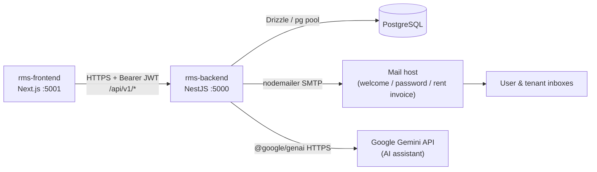
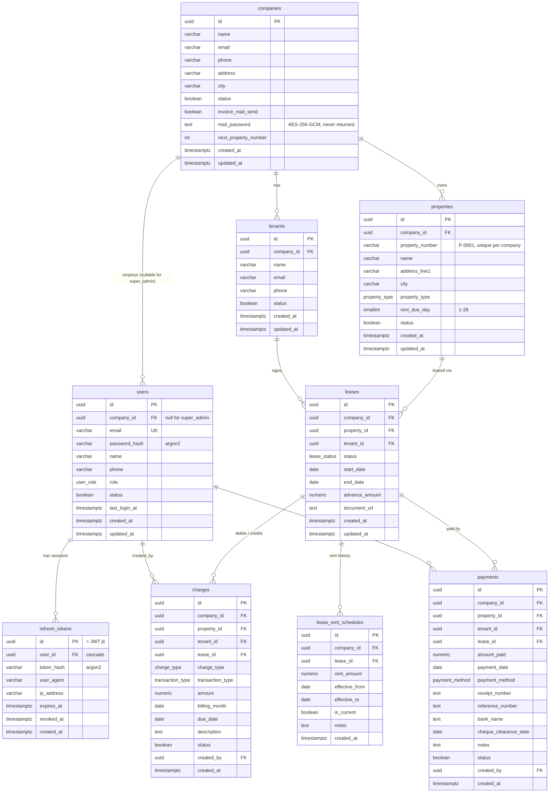
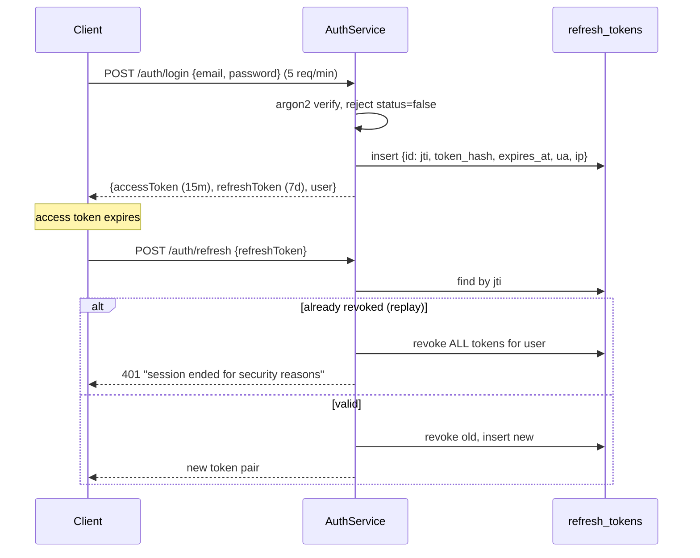
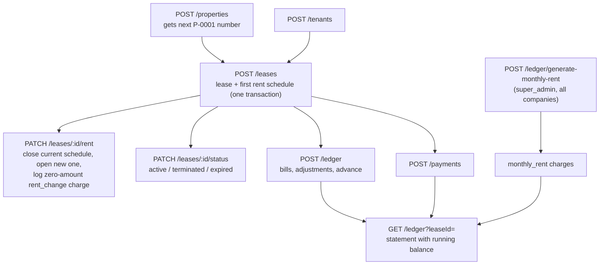

# RMS Backend

**Rent Management System API**: a multi-company platform where property-management companies track properties, tenants, leases, monthly rent, bills and payments.

NestJS 12 (ESM) + Drizzle ORM + PostgreSQL. The UI lives in the sibling repo [`rms-frontend`](../rms-frontend/README.md).

---

## Contents

1. [How the system fits together](#how-the-system-fits-together)
2. [Roles](#roles)
3. [Getting started](#getting-started)
4. [Scripts](#scripts)
5. [Configuration](#configuration)
6. [Project structure](#project-structure)
7. [Database structure](#database-structure)
8. [Business flows](#business-flows)
9. [API reference](#api-reference)
10. [Request and response shape](#request-and-response-shape)
11. [Conventions](#conventions)

---

## How the system fits together



Every request goes through the same pipeline:

```
Request
  → helmet, compression, CORS, request logger
  → RateLimitGuard → JwtAuthGuard → RolesGuard        (global guards)
  → ValidationPipe (whitelist + forbidNonWhitelisted)  (DTO validation)
  → Controller → Service → Repository → PostgreSQL
  → ResponseInterceptor (success envelope) / AllExceptionsFilter (error envelope)
  ← TimeoutInterceptor caps the whole thing at REQUEST_TIMEOUT_MS (or a route's @RequestTimeout)
```

---

## Roles

| Role | Scope | What it can do |
| --- | --- | --- |
| `super_admin` | Platform, **no company** (enforced by a DB check) | Manages companies and users, runs the monthly rent generation for every company |
| `client_admin` | One company | Manages its company's properties, tenants, leases, ledger, payments and dashboard |
| `manager`, `staff` | One company | Roles exist in the schema; no routes are opened to them yet |
| `customer` | — | Created by public `POST /auth/register`; no routes are opened to it yet |

Every company-scoped query is filtered by the caller's `companyId`, taken from the JWT via `@CurrentCompanyId()`, so a client admin can never read or write another company's data. Composite foreign keys enforce the same rule inside the database (see [Cross-company integrity](#cross-company-integrity)).

---

## Getting started

### Requirements

- Node.js >= 22
- pnpm >= 10 (`corepack enable pnpm`). **pnpm only.** `npm install` writes a `package-lock.json` that conflicts with `pnpm-lock.yaml`.
- PostgreSQL 14+

### First run

```bash
pnpm install
# create .env.local (or .env) and fill in the variables listed under Configuration
pnpm db:push             # push src/database/schema straight to the database
pnpm db:seed             # create the super admin from SEED_SUPER_ADMIN_*
pnpm db:seed:demo        # optional: 12 months of demo data for 3 companies
pnpm start:dev
```

With the local `.env.local` (`PORT=5000`):

- API: `http://localhost:5000/api/v1`
- Swagger UI: `http://localhost:5000/docs`
- Probes: `http://localhost:5000/health/liveness` and `/health/readiness` (no prefix, no version)

Generate secrets with:

```bash
node -e "console.log(require('node:crypto').randomBytes(48).toString('hex'))"   # JWT secrets
openssl rand -hex 32                                                            # MAIL_ENCRYPTION_KEY
```

---

## Scripts

| Script | What it does |
| --- | --- |
| `pnpm start:dev` | Watch-mode dev server |
| `pnpm start:debug` | Watch mode with the inspector attached |
| `pnpm build` | Compile to `dist/` |
| `pnpm start:prod` | Run the compiled build |
| `pnpm lint` | oxlint with type-aware rules |
| `pnpm format` | Prettier over `src/` and `test/` |
| `pnpm test` / `test:watch` / `test:cov` | Unit tests (vitest) |
| `pnpm test:e2e` | End-to-end tests |
| `pnpm db:push` | Push the Drizzle schema straight to the database |
| `pnpm db:seed` | Create the super admin from `SEED_SUPER_ADMIN_*` (idempotent) |
| `pnpm db:seed:demo` | Seed a trailing 12-month Pakistani demo dataset: 3 companies with properties, tenants, leases, rent schedules, charges and payments (idempotent per company) |
| `pnpm db:reset` | Drop and recreate the local database (refuses to run when `NODE_ENV=production`) |
| `pnpm db:studio` | Drizzle Studio |
| `pnpm db:generate` / `db:migrate` | drizzle-kit migration commands. Not part of the normal workflow; see [Schema changes](#schema-changes) |

Before calling a change done:

```bash
npx tsc --noEmit && pnpm lint && pnpm test
```

---

## Configuration

Every variable is declared and validated in [src/config/env.validation.ts](src/config/env.validation.ts). Startup fails with **every** invalid variable listed at once. Files are read in the order `.env.local`, then `.env` (first one wins).

| Group | Variable | Default | Notes |
| --- | --- | --- | --- |
| App | `NODE_ENV` | `development` | `development` / `test` / `production` |
| | `PORT` | `3000` | Local setup uses `5000` |
| | `API_PREFIX` / `API_VERSION` | `api` / `1` | Gives `/api/v1/...` |
| | `CORS_ORIGINS` | `*` | Comma-separated; must include the frontend origin |
| | `REQUEST_TIMEOUT_MS` | `15000` | Global request timeout |
| | `LOG_LEVEL` | `info` | |
| | `SWAGGER_ENABLED` / `SWAGGER_PATH` | `true` / `docs` | |
| | `THROTTLE_TTL_MS` / `THROTTLE_LIMIT` | `60000` / `100` | Global rate limit; login has its own 5/min |
| Database | `DATABASE_URL` | **required** | |
| | `DATABASE_POOL_MAX` | `10` | |
| | `DATABASE_SSL` / `DATABASE_LOG_QUERIES` | `false` | |
| JWT | `JWT_ACCESS_SECRET` / `JWT_REFRESH_SECRET` | **required** | At least 32 chars each |
| | `JWT_ACCESS_EXPIRES_IN` / `JWT_REFRESH_EXPIRES_IN` | `15m` / `7d` | |
| | `JWT_ISSUER` | `rms-backend` | |
| Seed | `SEED_SUPER_ADMIN_EMAIL` / `_PASSWORD` / `_NAME` | `superadmin@rms.local` / — / `Super Admin` | Password needed only by `db:seed` |
| Mail | `MAIL_HOST`, `MAIL_USER`, `MAIL_PASSWORD` | **required** | Platform SMTP account |
| | `MAIL_PORT` / `MAIL_SECURE` | `587` / `false` | |
| | `MAIL_FROM` | `no-reply@rms.local` | |
| | `MAIL_ENCRYPTION_KEY` | **required** | 64 hex chars. Encrypts `companies.mail_password`; **changing it makes every stored company mail password undecryptable** |
| | `FRONTEND_URL` | **required** | Used for the "Sign in" button in emails |
| AI | `GOOGLE_STUDIO_KEY` | — | Gemini API key from Google AI Studio. Optional: without it the API boots and `POST /ai/chat` answers 503 |
| | `GEMINI_MODEL` | `gemini-flash-lite-latest` | Any Gemini model id the key can use. Flash-lite answers in about 1 to 3 s per call, which suits voice |

To add a variable, declare it in `env.validation.ts` first, then expose it through the matching `registerAs` namespace in `src/config/`.

---

## Project structure

```
rms-backend/
├── drizzle.config.ts              # drizzle-kit: schema path + DATABASE_URL
├── nest-cli.json
├── scripts/
│   └── reset-db.ts                # pnpm db:reset (drop + recreate local DB)
├── test/                          # e2e specs + vitest setup (TZ=UTC)
└── src/
    ├── main.ts                    # Bootstrap: logger, helmet, compression, CORS, prefix, versioning, Swagger
    ├── app.module.ts              # Root module + global pipe, filter, interceptors, guards
    ├── bootstrap/
    │   ├── swagger.bootstrap.ts
    │   └── timezone.bootstrap.ts  # process.env.TZ = 'UTC', imported first
    ├── config/                    # registerAs namespaces (app, database, jwt, mail, seed, ai) + zod env schema
    │   └── interfaces/
    ├── common/                    # Cross-cutting, domain-agnostic building blocks
    │   ├── constants/             # pagination, rent due day (1-28), postgres error codes, metadata keys
    │   ├── decorators/            # @Public @Roles @CurrentUser @CurrentCompanyId @ResponseMessage
    │   │                          # @RateLimit @RequestTimeout @SkipResponseTransform @IsMoneyString
    │   ├── dto/                   # PaginationQueryDto, UuidParamDto, AssignedEntityDto
    │   ├── enums/                 # UserRole, LeaseStatus, ChargeType, TransactionType, PaymentMethod,
    │   │                          # PropertyType, SortOrder, ErrorCode, DashboardTrendRange, AiChatRole
    │   ├── filters/               # AllExceptionsFilter → error envelope
    │   ├── guards/                # RateLimitGuard (in-memory buckets)
    │   ├── interceptors/          # ResponseInterceptor (success envelope), TimeoutInterceptor
    │   ├── interfaces/
    │   ├── middleware/            # request logger
    │   └── utils/                 # pagination, query (search), database-error, hash (argon2), jwt,
    │                              # uuid (v7), encryption (AES-256-GCM), email-template, date,
    │                              # outstanding-balance SQL, background (Vercel waitUntil), logger,
    │                              # ai-tool (zod schema → Gemini function declaration)
    ├── database/
    │   ├── database.module.ts     # Global module: DRIZZLE + PG_POOL, session pinned to UTC
    │   ├── schema/                # One file per table + barrel index.ts
    │   ├── interfaces/            # Row types inferred from the schema ($inferSelect / $inferInsert)
    │   ├── migrations/            # Initial snapshot only; schema changes go through db:push
    │   └── seeds/                 # super admin seed, Pakistani demo dataset
    └── modules/                   # One folder per domain, same shape each time
        ├── auth/                  # register, login, refresh rotation, logout, me, JWT strategy, guards
        ├── users/                 # super_admin: platform user management
        ├── companies/             # super_admin: company management + mail settings
        ├── properties/            # client_admin: properties with per-company numbers (P-0001)
        ├── tenants/               # client_admin: tenants
        ├── leases/                # client_admin: leases, status changes, rent schedule changes
        ├── ledger/                # charges + running-balance statement, monthly rent generation
        ├── payments/              # client_admin: payments against a lease
        ├── dashboard/             # client_admin: aggregated company stats
        ├── ai/                    # client_admin: Gemini assistant with read-only tools over the modules above
        ├── mail/                  # SMTP sending (platform or per-company sender), throttled queue
        └── health/                # Terminus liveness / readiness
```

Every domain module has the same internal shape:

```
modules/<name>/
├── dto/                    create / update (PartialType of create) / query (extends PaginationQueryDto) / response
├── interfaces/             i-find-<name>-options.ts, i-<name>-list-result.ts, ...
├── mappers/<name>.mapper.ts   row → response DTO, strips anything secret
├── <name>.constants.ts     constraint name → client-facing message
├── <name>.repository.ts    the ONLY file that touches Drizzle
├── <name>.service.ts       business rules, throws HTTP exceptions
├── <name>.controller.ts    validate + delegate
└── <name>.module.ts
```

---

## Database structure

### Entity relationships



### Tables

| Table | Purpose | Key constraints |
| --- | --- | --- |
| `companies` | A property-management company (the multi-tenant boundary) | `next_property_number` is the per-company counter for property numbers |
| `users` | Login accounts | `users_email_unique_idx` (email is the login id); check `users_super_admin_has_no_company` |
| `refresh_tokens` | One row per issued refresh token, keyed by its `jti` | `ON DELETE CASCADE` from users |
| `properties` | A rentable unit | Unique `(company_id, property_number)`; check `rent_due_day BETWEEN 1 AND 28` |
| `tenants` | A person who rents | — |
| `leases` | Ties one tenant to one property for a date range | Partial unique index `leases_one_active_per_property_idx`: **at most one `active` lease per property** |
| `lease_rent_schedules` | Rent amount history for a lease | Partial unique index: **at most one `is_current` schedule per lease** |
| `charges` | The ledger's debits and credits (rent, bills, adjustments) | Partial unique index: **one active `monthly_rent` per lease per `billing_month`** |
| `payments` | Money received against a lease | — |

### Enums

| Postgres enum | Values |
| --- | --- |
| `user_role` | `super_admin`, `client_admin`, `manager`, `staff`, `customer` |
| `property_type` | `home`, `apartment`, `room`, `shop`, `office`, `warehouse`, `land`, `other` |
| `lease_status` | `active`, `terminated`, `expired` |
| `charge_type` | `monthly_rent`\*, `rent_change`\*, `electricity_bill`, `water_bill`, `maintenance_charge`, `other_charge`, `advance_payment`, `discount_adjustment`, `advance_refund` |
| `transaction_type` | `debit`, `credit` (only `discount_adjustment` is a credit) |
| `payment_method` | `cash`, `bank_transfer`, `cheque`, `online` |

\* System-generated only. `POST /ledger` rejects them.

### Cross-company integrity

`properties`, `tenants`, `leases` and `payments` each have a unique `(id, company_id)` key. Child tables reference the **pair**, not just the id:

```
leases(property_id, company_id)            → properties(id, company_id)
leases(tenant_id, company_id)              → tenants(id, company_id)
lease_rent_schedules(lease_id, company_id) → leases(id, company_id)
charges / payments (property|tenant|lease, company_id) → same pairs
```

A lease, charge or payment therefore can't point at a row from another company, even if a service-layer check is missed.

### Indexes

Every table has a `(created_at DESC, id DESC)` index, and company-scoped tables also have `(company_id, created_at DESC, id DESC)`. This serves the default newest-first listing without a sort step.

### Design rules

- **Primary keys are UUIDv7** ([uuid.util.ts](src/common/utils/uuid.util.ts)). They are time-ordered, so inserts append to the B-tree like a sequence while ids stay globally unique and non-enumerable. They sort chronologically as strings. DTOs validate with `@IsUUID()` (any version); `@IsUUID('4')` would reject every id this app issues.
- **`status`, not `deleted_at`.** One boolean per row: `true` is active and `false` is deactivated. `DELETE` sets it to false and `PATCH /:id/restore` sets it back. Rows are never physically removed. Reads do not filter on `status`, so an admin can still see and restore a row. Auth paths reject `status: false` explicitly. Leases are the exception: they use `lease_status` instead.
- **Money is `numeric(10,2)`**, sent and received as strings (`"2500.00"`), validated by `@IsMoneyString()`.
- **Balances are computed, not stored.** [`OUTSTANDING_BALANCE_SQL`](src/common/utils/outstanding-balance.util.ts) is `Σ active debits − Σ active credits − Σ active payments` for a lease.
- **UTC everywhere.** Columns are `timestamptz`, the PG session runs with `timezone=UTC`, the Node process sets `TZ=UTC` before anything else loads, and tests do the same. Calendar values (`start_date`, `billing_month`, `due_date`, ...) are plain `date`.

### Schema changes

There are no migration files in the workflow:

1. Edit or add a table under [src/database/schema/](src/database/schema/) and export it from `index.ts`.
2. Add the row type under `src/database/interfaces/i-<name>-row.ts` (`typeof table.$inferSelect`).
3. Run `pnpm db:push`, and `pnpm db:seed` if needed.

When you add a `NOT NULL` column to a table that already has rows, backfill it first or give it a default. Otherwise `db:push` offers to truncate the table, which would orphan its children. Answer **No**.

---

## Business flows

### 1. Authentication and sessions



- Users sign in with **email** (unique, normalised to lower case).
- The access token carries `{ sub, role, companyId }`. The refresh token carries `{ sub, jti }` and is stored argon2-hashed.
- `POST /auth/logout` revokes one refresh token. `POST /auth/logout-all` revokes all of them. `GET /auth/me` returns the user plus `companyName`.
- `JwtAuthGuard` and `RolesGuard` are global, so every route is protected unless it has `@Public()`.

### 2. Platform setup (super_admin)

```
db:seed → super_admin
   └─ POST /companies          create company (optional SMTP email + mail_password, invoice_mail_send)
       └─ POST /users          create client_admin with companyId → welcome email with credentials
```

- A `super_admin` can't have a `companyId`. The service checks this, and so does a DB check constraint.
- When a user is created, a **welcome email** with the login details goes out from the platform account (sender name "MIFA Alliance"). Changing a password through `PATCH /users/:id` sends a **password-changed email**.
- A company can't be deactivated while it still has active users. Deactivate the users first.
- `companies.mail_password` is AES-256-GCM encrypted with `MAIL_ENCRYPTION_KEY` and is never returned by the API.

### 3. Company operations (client_admin)



**Properties.** Each property gets a human-readable number (`P-0001`, `P-0002`, ...) from `companies.next_property_number`, which is incremented in the same transaction as the insert. The number never changes. `rent_due_day` (1–28) sets which day of the month the generated rent falls due.

**Leases.**
- Creating a lease requires the property and the tenant to be active, and the property to have no other active lease. The pre-check gives a clear message, and `leases_one_active_per_property_idx` is the real guard against races.
- The lease and its first `lease_rent_schedules` row (`effective_from = start_date`, `is_current = true`) are inserted in **one transaction**.
- `PATCH /leases/:id` edits the dates, the advance amount or `document_url`.
- `PATCH /leases/:id/status` changes the status. Reactivating a lease runs the one-active-lease check again.
- `PATCH /leases/:id/rent` changes the rent. The new `effective_from` must be after the current schedule's start. In one transaction, the current schedule is closed (`effective_to`, `is_current = false`), the new one is opened, and a `rent_change` charge of `0.00` is written with a description such as `Rent changed from 50000 to 55000, effective 2026-11-01`. That way the change appears on the statement without affecting the balance.

### 4. Monthly rent generation

`POST /ledger/generate-monthly-rent` is restricted to `super_admin` and runs across **every company**:

1. Sets the billing month to the first day of the current month.
2. Loads every active lease with its current rent schedule, its property's `rent_due_day`, and the tenant's email.
3. Skips leases with `no_rent_schedule` or `already_generated` for this month, and returns them in `skipped`.
4. Inserts one `monthly_rent` debit per due lease, with `due_date = billing month + rent_due_day` and the description `Monthly rent for October 2026`. The partial unique index blocks duplicates from double clicks.
5. Returns `{ billingMonth, generated, skipped }` straight away.
6. **In the background** (kept alive on Vercel with `waitUntil`), emails a rent invoice to each tenant that has an email, but only for companies with `invoice_mail_send = true`. Mail goes out from **that company's own SMTP account**. A company with no email or mail password is skipped and the reason is logged. Sends are throttled to 5 concurrent connections. A mail failure never affects the billing run.

### 5. Ledger and payments

- **Charges** (`POST /ledger`) can be `electricity_bill`, `water_bill`, `maintenance_charge`, `other_charge`, `advance_payment` or `advance_refund` (all debits), or `discount_adjustment` (a credit). The property and tenant are taken from the lease.
- **Payments** (`POST /payments`) record the amount, date, method and optional receipt or reference number, bank, cheque clearance date and notes.
- **Statement** (`GET /ledger`) merges charges and payments into one list. A running balance is calculated per lease in insertion order: debits add, credits and payments subtract. Entries are shown newest billing month first.
- **Deactivating** a charge (`DELETE /ledger/charges/:id`) or a payment (`DELETE /payments/:id`) keeps the row on the statement but leaves it out of every balance. Use `restore` to bring it back. Deactivating a `monthly_rent` charge lets the next run generate that month again.

### 6. Dashboard

`GET /dashboard/stats?trendRange=6m|1y|all` (client_admin, default `6m`) returns:

- **Totals:** tenants, active tenants, properties, active leases, occupied properties (equal to active leases, because of the one-active-lease constraint), and this month's payment count and total compared with last month.
- **Trends:** payment totals per month (gaps filled with `0.00`).
- **Breakdown:** active vs deactivated property counts.
- **Lists:** the 5 most recent payments and the 5 leases with the highest outstanding balance.

### 7. AI assistant

`POST /ai/chat` (client_admin) answers plain-language questions about the caller's company, such as "who still owes rent?", "summarise this month" or "when did Ahmed Raza last pay?".

```json
{ "message": "And when did they last pay?", "history": [{ "role": "user", "text": "..." }, { "role": "model", "text": "..." }] }
```

- **Stateless.** The client sends earlier turns in `history`, oldest first, up to 20. The reply is `{ reply, toolsUsed }`.
- **Tool calling.** Gemini never touches the database. It calls tools declared in [ai-tools.service.ts](src/modules/ai/ai-tools.service.ts), and each tool calls an existing service (`DashboardService`, `PropertiesService`, `TenantsService`, `LeasesService`, `PaymentsService`, `LedgerService`) with the caller's `companyId`. Validation, scoping and error messages therefore stay the same as in the REST routes.
- **Read-only for now.** Writes (create a tenant, record a payment) need a confirmation step before Gemini may trigger them, so the assistant points the user to the matching screen instead.
- **Errors.** A tool failure such as a `NotFound` is handed back to Gemini, which explains it. A Gemini overload or timeout returns 503 with a retry hint, after up to 3 attempts. Running out of quota returns 429. A missing `GOOGLE_STUDIO_KEY` returns 503.
- **Limits.** 20 requests per minute per client, and a 60 s route timeout instead of `REQUEST_TIMEOUT_MS`, because one answer can take several Gemini calls.
- **Voice.** Speech-to-text and text-to-speech happen in the frontend. This endpoint only ever sees text.

---

## API reference

All routes are under `/api/v1` unless noted. Swagger at `/docs` is the authoritative contract.

| Module | Method & path | Access |
| --- | --- | --- |
| **auth** | `POST /auth/register` · `POST /auth/login` · `POST /auth/refresh` · `POST /auth/logout` | Public (login is limited to 5/min) |
| | `POST /auth/logout-all` · `GET /auth/me` | Any signed-in user |
| **companies** | `POST` · `GET` · `GET /:id` · `PATCH /:id` · `PATCH /:id/restore` · `DELETE /:id` | super_admin |
| **users** | `POST` · `GET` · `GET /:id` · `PATCH /:id` · `PATCH /:id/restore` · `DELETE /:id` | super_admin |
| **properties** | `POST` · `GET` · `GET /:id` · `PATCH /:id` · `PATCH /:id/restore` · `DELETE /:id` | client_admin |
| **tenants** | `POST` · `GET` · `GET /:id` · `PATCH /:id` · `PATCH /:id/restore` · `DELETE /:id` | client_admin |
| **leases** | `POST` · `GET` · `GET /:id` · `PATCH /:id` · `PATCH /:id/status` · `PATCH /:id/rent` | client_admin |
| **ledger** | `POST` · `GET` · `GET /:id` · `PATCH /charges/:id/restore` · `DELETE /charges/:id` | client_admin |
| | `POST /ledger/generate-monthly-rent` | super_admin |
| **payments** | `POST` · `GET` · `GET /:id` · `PATCH /:id/restore` · `DELETE /:id` | client_admin |
| **dashboard** | `GET /dashboard/stats` | client_admin |
| **ai** | `POST /ai/chat` | client_admin (20/min) |
| **health** | `GET /health/liveness` · `GET /health/readiness` (no prefix) | Public |

### List endpoints

Every list endpoint accepts `page`, `limit` (max 100), `search` and `sortOrder` (default `desc`), plus module-specific filters, and returns `{ items, meta }`:

```
GET /api/v1/leases?page=1&limit=20&search=ali&status=active&propertyId=<uuid>
```

- Sorting is newest first by `created_at`, with `id` as a stable tiebreaker (UUIDv7).
- Search is a case-insensitive contains match through `buildSearchCondition()`. `LIKE` wildcards in user input are escaped.
- The count and page queries run together in one `Promise.all` with the same `where`.

---

## Request and response shape

Every response has the same four keys:

```json
{ "success": true, "message": "Lease created successfully", "data": { }, "error": null }
```

```json
{
  "success": false,
  "message": "Validation failed. Please check the submitted fields.",
  "data": null,
  "error": { "code": "VALIDATION_ERROR", "details": ["email must be an email"] }
}
```

- `error.code` is an [`ErrorCode`](src/common/enums/error-code.enum.ts) that clients can branch on. `message` is for people to read, and `details` lists the per-field problems.
- `@ResponseMessage('...')` sets the success message on each route. `@SkipResponseTransform()` returns the payload as is (the health routes use it).
- `DELETE` returns **200**, not 204, so the envelope always reaches the client.
- Database errors are mapped by `withDatabaseErrors()`: `23505` becomes a 409, `23503`/`23514` become a 400, and deadlocks become a retryable 409. Each module has a `<module>.constants.ts` that maps constraint names to readable messages.
- In production, internal errors are logged and the client gets a generic `INTERNAL_ERROR`.

---

## Conventions

The full checklist is in [CLAUDE.md](CLAUDE.md). The main points:

- **Layering.** Controllers validate and delegate. Services hold the business rules and throw `NotFound` / `Conflict` / `BadRequest` with a message that names the record and the fix. Repositories are the only files that touch Drizzle, and they wrap every write in `withDatabaseErrors`.
- **Controllers.** Each has `@ApiTags`, `@ApiBearerAuth` and `@ApiOperation`, plus `@ResponseMessage` on every route. `@Roles(...)` is set once on the class. Ids are read through `@Param() params: UuidParamDto`.
- **ESM.** Every relative import ends in `.js`, including in `.ts` files (`nodenext`).
- **Types.** No `any`. Interfaces live in their own files under `interfaces/` and start with `I`. Row types are inferred from the schema.
- **Helpers** belong in `common/utils/`, written generically.
- **Style.** Comments are one line at most. Use `const` by default and camelCase.
- **Adding a module:** copy `modules/companies/` or `modules/users/`, then register the module in [app.module.ts](src/app.module.ts).
